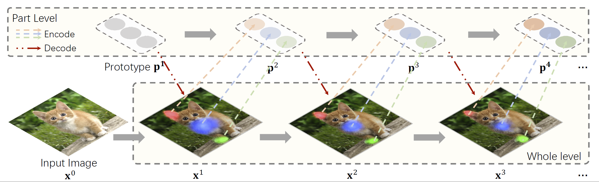

# Visual Parser (ViP)

This is the official implementation of the paper [Visual Parser: Representing Part-whole Hierarchies with Transformers](https://arxiv.org/abs/2107.05790).




## Key Features & TLDR
1. PyTorch Implementation of the ViP network. Check it out at [models/vip.py](models/vip.py)

2. A fast and neat implementation of the [relative positional encoding](models/vip_layers.py#L30) 
   proposed in [HaloNet](https://arxiv.org/abs/2103.12731), [BOTNet](https://arxiv.org/abs/2101.11605) 
   and [AANet](https://arxiv.org/abs/1904.09925).
   
3. A transformer-friendly [FLOPS & Param counter](test_flops.py) that supports FLOPS calculation for `einsum` and `matmul` operations.


## Prerequisite
Please refer to [get_started.md](get_started.md).


## Results and Models
*All models listed below are evaluated with input size 224x224*

| Model      | Top1 Acc | #params | FLOPS |   Download  |
| :---       |  :---:   |  :---:  | :---: |    :---:    | 
| ViP-Tiny   |  79.0    |  12.8M  | 1.7G  | [Google Drive](https://drive.google.com/file/d/11RhKENVQVgB7UCpZZiVy10GaNGvy5iyU/view?usp=sharing) |
| ViP-Small  |  82.1    |  32.1M  | 4.5G  | [Google Drive](https://drive.google.com/file/d/1CMQIimOxcAsXOjFne89QPTwgov5TA7SI/view?usp=sharing) |
| ViP-Medium |  83.3    |  49.6M  | 8.0G  | Coming Soon |
| ViP-Base   |  83.6    |  87.8M  | 15.0G | Coming Soon |

To load the pretrained checkpoint, e.g. `ViP-Tiny`, simply run:
```python
# first download the checkpoint and name it as vip_t_dict.pth
from models.vip import vip_tiny
model = vip_tiny(pretrained="vip_t_dict.pth")
```

### Evaluation

To evaluate a pre-trained `ViP` on ImageNet val, run:

```bash
python3 main.py <data-root> --model <model-name> -b <batch-size> --eval_checkpoint <path-to-checkpoint>
```

### Training from scratch

To train a `ViP` on ImageNet from scratch, run:

```bash
bash ./distributed_train.sh <job-name> <config-path> <num-gpus>
```


For example, to train `ViP` with 8 GPU on a single node, run:

`ViP-Tiny`:

```bash
bash ./distributed_train.sh vip-t-001 configs/vip_t_bs1024.yaml 8
```

`ViP-Small`:

```bash
bash ./distributed_train.sh vip-s-001 configs/vip_s_bs1024.yaml 8
```

`ViP-Medium`:

```bash
bash ./distributed_train.sh vip-m-001 configs/vip_m_bs1024.yaml 8
```

`ViP-Base`:

```bash
bash ./distributed_train.sh vip-b-001 configs/vip_b_bs1024.yaml 8
```

### Profiling the model

To measure the throughput, run:

```bash
python3 test_throughput.py <model-name>
```

For example, if you want to get the test speed of `Vip-Tiny` on your device, run:
```bash
python3 test_throughput.py vip-tiny
```


To measure the FLOPS and number of parameters, run:

```bash
python3 test_flops.py <model-name>
```

## Citing ViP
```
@article{vip,
  title={Visual Parser: Representing Part-whole Hierarchies with Transformers},
  author={Sun, Shuyang and Yue, Xiaoyu, Bai, Song and Torr, Philip},
  journal={arXiv preprint arXiv:2107.05790},
  year={2021}
}
```

## Contact
If you have any questions, don't hesitate to contact Shuyang (Kevin) Sun.
You can easily reach him by sending an email to kevinsun@robots.ox.ac.uk.
